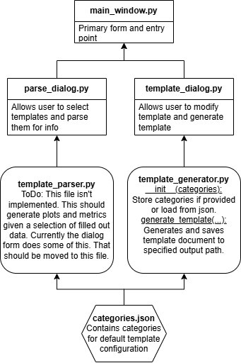

# Feedback Template Generator and Parser Tool
Last updated: 12/06/2024

### Overview

This project provides a PyQt5-based desktop application for generating and parsing structured feedback templates designed for research groups. The tool simplifies collecting and analyzing feedback by using consistent, customizable templates. It allows users to both create feedback templates and parse completed templates into structured data for analysis.


---

## Features

### 1. **Main Window**
   - Acts as the hub for the application, allowing users to:
     - Generate a new feedback template.
     - Parse existing feedback templates.

### 2. **Feedback Template Generation**
   - **Dialog:** `template_dialog.py`
   - **Logic:** `template_generator.py`
   - Enables users to:
     - Generate feedback templates as `.docx` files.
     - Specify categories and metrics using a baseline configuration from `categories.json`.
     - Customize reviewer details, researcher details, and filenames.
   - Templates include:
     - Categories and associated metrics for evaluation.
     - Space for scores (1-5) and comments.

### 3. **Feedback Template Parsing**
   - **Dialog:** `parse_dialog.py`
   - Allows users to:
     - Select and parse `.docx` files with completed feedback templates.
     - Extract data into categories, metrics, and scores.
     - Display parsed data in a table within the UI.

### 4. **Baseline Categories**
   - Stored in `categories.json`.
   - Provides default feedback categories and metrics.
   - Customizable through the template generation dialog.

---

## Dependencies

   ```bash
   pip install PyQt5 python-docx
   ```

---

## Usage

1. Run the main application:
   ```bash
   python main_window.py
   ```
2. **Generate Templates:**
   - Click "Generate Template" to open the template generation dialog.
   - Fill in details, customize categories/metrics, and save the `.docx` file.
3. **Parse Templates:**
   - Click "Parse Template" to open the parser dialog.
   - Select `.docx` files and parse feedback data into a structured table.

---

## To-Do and Known Issues

### **General:**
- Add error handling for missing `categories.json`.
- Improve configuration management by allowing users to edit `categories.json` from the UI.

### **Template Generation:**
- Add an option to dynamically create new categories through the UI (`Add Category` button is currently commented out in `template_dialog.py`).

### **Template Parsing:**
- **Incomplete File:** Parsing logic is partly implemented in `parse_dialog.py` but needs to be refactored into `template_parser.py`.
- Add visualization tools to plot parsed metrics, such as:
  - Weekly averages.
  - Overall trends for categories and metrics.

### **UI:**
- Enhance UI/UX by adding:
  - Tooltips for buttons and inputs.
  - A progress bar for parsing multiple files.

### **Documentation:**
- Extend user documentation to include:
  - Examples of templates.
  - Sample parsed data and visualizations.

---
